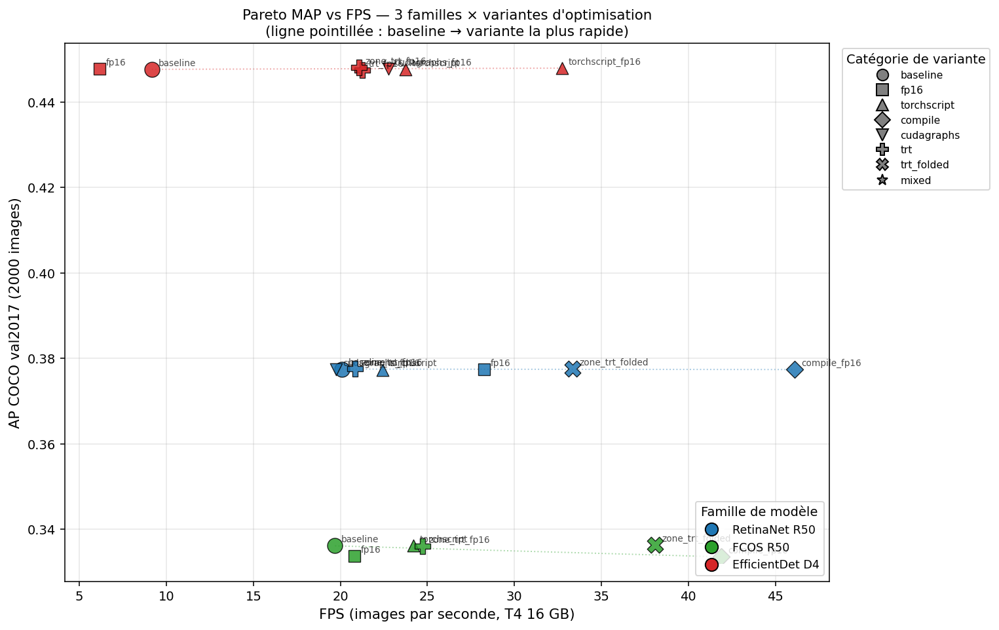
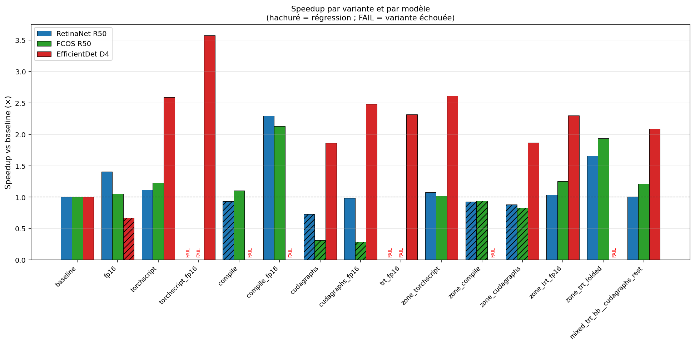
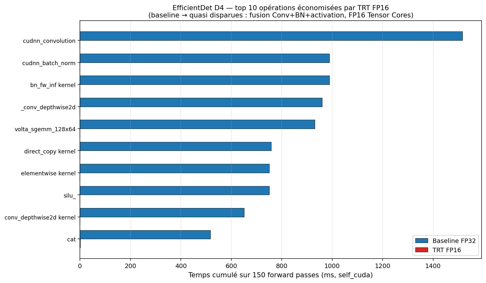

# Run #3 -- Modal T4 16 GB, 3 models x 13 variants

> **Run ID**: `20260616_122931`
>
> **Artifacts**: [`outputs/20260616_122931/`](../results/20260616_122931) -- available from @PacomeKFP
>
> **Choice rationale**: [`docs/runs_modal.md`](runs_modal.md)
>
> **Notes author**: PacomeKFP
>
> **Run date**: 16 June 2026

This document has two goals:
(1) serve as a **learning support** so that later we can recover why a given
variant produces a given number, and
(2) answer point by point the **three expectations of the advisor** (email
of 16 June) -- TRT at the sub-module level, extracting the fastest
operations, and an opening toward the next steps.

Reading advice: read in order. The numbers only make sense together with
the precise definition of the variant that produces them.

---

## 1. Preamble -- what we are trying to measure

We have three detection models from different families:

- **RetinaNet R50** -- `torchvision`, ResNet-50 + FPN + dense
  classification/regression heads, classic NMS
- **FCOS R50** -- `torchvision`, anchor-free, ResNet-50 + FPN, *centerness*
  head, NMS
- **EfficientDet D4** -- `effdet` (Ross Wightman), EfficientNet-B4 + BiFPN
  + heads

For each one we benchmark a **FP32 baseline** then a series of optimization
variants. Every time we measure: **mean time per image** (ms), **FPS**,
**COCO AP** (on 2000 val2017 images) and -- for the baselines and fp16 -- the
per-submodule and per-operation profile.

Three questions structure what follows:

1. **Which lever dominates on each architecture?** (answer: it depends on
   the model -- see Sec.4)
2. **Does TensorRT deliver at the operation level?** (answer: yes on
   EfficientDet, partially on torchvision -- see Sec.5)
3. **Which elementary building blocks are the most accelerable?**
   (Conv+BN+activation, depthwise, pointwise add -- see Sec.6)

---

## 2. Variant glossary -- what each tag *actually does*

This section addresses the request "describe what each tag is made of".
For each variant we give **(a)** what it does in practice, **(b)** the
theoretical motivation, and **(c)** the situation where it is supposed to
shine.

### `baseline`
- **What**: FP32 model loaded as-is, in `eval()` mode, executed with
  `torch.no_grad()`. No compilation, no explicit fusion, no precision
  conversion. cuDNN autotunes its kernels at the first forward (50 warmup
  iterations before the measurement).
- **Why**: this is the reference. Every speedup is measured against this
  point. It is also what you get when you "naively" deploy a PyTorch model
  without touching the runtime.
- **When it shines**: never -- it is the target to beat.

### `fp16` (pure autocast)
- **What**: wraps the forward in `torch.autocast(device_type="cuda",
  dtype=torch.float16)`. No graph, no fusion. PyTorch dynamically inserts
  FP32<->FP16 casts around every operation.
- **Why**: T4 Tensor Cores (Turing architecture, capability 7.5) execute
  FP16 matmuls ~2x faster than FP32. Autocast is meant to capture that gain
  without changing the code.
- **When it shines**: on heavily *compute-bound* models with large GEMMs
  (large backbones, large batch). **When the model is small and
  memory-bound, the casts cost more than they save**.

### `torchscript`
- **What**: three successive steps.
  1. `torch.jit.script(model)` -- analyzes the Python source code and
     produces a static graph. If script fails (non-scriptable model),
     fall back to `torch.jit.trace` with a sample input.
  2. `torch.jit.freeze` -- inlines weights as constants, removes useless
     attributes, opens the door to constant folding.
  3. `torch.jit.optimize_for_inference` -- inference-specific passes:
     **Conv+BatchNorm fusion** (the frozen BN stats are folded into the
     conv weights -> one layer instead of two), Conv+ReLU fusion via the
     NNC fuser, dead-code elimination.
- **Why**: get the "easy" fusions without depending on Triton (unlike
  `torch.compile`) or on TRT. Works everywhere, including on Windows.
- **When it shines**: on architectures with **many sequential
  Conv->BN->Activation blocks** (typically EfficientNet/BiFPN with their SiLU
  and depthwise convs). On pure torchvision (RetinaNet/FCOS), the gain is
  modest because part of the graph lives in dynamic Python code.

### `compile`
- **What**: `torch.compile(model, backend="inductor", mode="default",
  dynamic=False)`. *Inductor* is the PyTorch 2 compiler: it takes the FX
  graph captured by TorchDynamo and generates Triton code (specialized CUDA
  kernels) with aggressive fusion of pointwise operations and reductions.
- **Why**: modern compilation, big gains on regular models. `dynamic=False`
  because our shapes are fixed at 640x640.
- **When it shines**: alone, **rarely** -- on detectors it suffers from
  recompile loops caused by the dynamic NMS (decoding produces a variable
  number of boxes per image). Combined with FP16 it is a different story
  (see `compile_fp16`).

### `cudagraphs`
- **What**: `torch.compile(model, backend="cudagraphs")`. CUDA Graphs
  records a sequence of kernel launches as a single object that can be
  "replayed" in a single API call -> removes the *kernel launch overhead*
  (typically ~5-10 us per kernel x hundreds of kernels = significant
  potential on small models).
- **Why**: on a fast GPU, the Python+CUDA launch cost can dominate the
  actual compute time on small kernels.
- **When it shines**: **architectures with fully static shapes**. On
  detectors, FCOS and RetinaNet use CPU tensors inside
  `anchor_generator.set_cell_anchors` and
  `_batched_nms_coordinate_trick`, which **breaks the capture**
  (cudagraphs refuses CPU tensors). See Sec.4 for the disastrous regressions.

### `compile_fp16`, `cudagraphs_fp16`, `torchscript_fp16`
- **What**: FP16 autocast + one of the three compilations above. The order:
  we enter `torch.autocast`, then the compiled forward runs in FP16.
- **Why**: combine *Tensor Cores gain* + *fusion/compilation gain*. The
  combination is almost always better than any ingredient alone.
- **When it shines**: `compile_fp16` is **the historical full-model
  winner** on torchvision. Same here (x2.13 FCOS, x2.29 RetinaNet).

### `trt_fp16` (full model)
- **What**: `torch_tensorrt.compile(model,
  enabled_precisions={torch.float16})` on the full model. Under the hood
  TRT-Dynamo: graph capture via Dynamo -> partitioning into TRT-compatible
  vs eager sub-graphs -> compilation of the sub-graphs into TRT engines
  (which contain native CUDA kernels with Conv+BN+activation fusion,
  optimal tactic selection via internal benchmarking, kernel cache).
- **Why**: this is theoretically the most powerful optimization -- TRT
  recompiles into native kernels specialized for the target GPU, whereas
  TorchScript stays in the PyTorch runtime.
- **When it shines**: on **models with purely static shapes**. On
  RetinaNet/FCOS, **the NMS produces a variable number of detections** ->
  dynamic shapes with an unbounded upper bound (`Infinity`) -> sympy bug ->
  TRT compilation crash (see Sec.3.2).

### `zone_torchscript`, `zone_compile`, `zone_cudagraphs`, `zone_trt_fp16`
- **What**: we isolate a **static zone** of the model (typically
  backbone+FPN, sometimes the heads), compile it, and leave the
  post-processing (NMS) in eager. For `zone_trt_fp16` this is exactly what
  TRT asks for: a fixed-shape sub-graph.
- **Why**: bypass the dynamic-shape NMS problem while capturing the gain
  on the ~80-90% of time spent in the backbone and the classification head.
- **When it shines**: it is *the* clean TRT path that the advisor requires
  -- no crash, AP preserved exactly, real gain.

### `zone_trt_folded`
- **What**: before TRT, we apply `torch.jit.freeze` to propagate the
  constants (frozen weights -> the multiplications by the BiFPN coefficients
  become weighted additions with pre-computed coefficients). Then we go
  through TRT.
- **Why**: TRT explicitly asked for it in the Run #1 logs -- "*consider
  constant fold the model first*". The weighted fusion of EfficientDet's
  BiFPN and some FPN+heads patterns are typical targets.
- **When it shines**: on architectures that perform weighted combinations
  of feature maps (BiFPN). Run surprise: it also shines on **RetinaNet
  and FCOS** (x1.66 and x1.93), proof that constant folding unlocks more
  than just the BiFPN.

### `mixed_trt_bb__cudagraphs_rest`
- **What**: TRT on the backbone only + cudagraphs on the rest
  (FPN+heads). The idea is to use TRT where it excels (regular
  convolutions) and cudagraphs where the launch overhead dominates (the
  hundreds of small kernels in the heads).
- **Why**: combine the strengths. But the transitions between optimized
  regions cost something (buffer copies, synchronizations).
- **When it shines**: potentially when TRT alone cannot compile
  everything, and cudagraphs works on the rest. In practice here,
  comparable to TRT alone (cf. Sec.4).

### `zone_trt_int8` -- not executed
- **What was planned**: INT8 calibration on 300 images, conversion of
  weights/activations to 8-bit integer via Post-Training Quantization (PTQ).
- **Why not executed**: `do_int8=False` flag in the run config. TRT-Dynamo
  in INT8 requires `modelopt` (NVIDIA TensorRT-Model-Optimizer) which is
  not installed in the image. To enable in the next run if we want to
  explore this lead.

---

## 3. Exact run conditions

### 3.1. Environment

- **Modal image**: `debian_slim(python_version="3.13")` + pip install of
  the dependencies *from scratch* (just like on Colab).
- **Key versions** validated by [`modal_test_env.py`](../modal_test_env.py):
  - `torch 2.8.0+cu128`
  - `torch_tensorrt 2.8.0`
  - `tensorrt 10.12.0.36`
  - `numpy 2.4.6`
  - `cv2 4.13.0`
- **GPU**: T4 16 GB (Turing, capability 7.5, FP16 Tensor Cores, **no** BF16
  or INT8 Tensor Cores at the hardware level).
- **Granularity**: 1 Modal container per (model, variant) pair -- no
  cross-variant state pollution.
- **Shared caches** on the Modal Volume: `TORCH_HOME=/data/cache/torch`,
  `HF_HOME=/data/cache/hf` -> torchvision/effdet weights downloaded once
  and reused.

### 3.2. Bench parameters

| Parameter | Value | Role |
|---|---|---|
| `N_WARMUP` | 50 | Warm-up iterations (compile + cuDNN autotune) |
| `N_MEASURE` | 1000 | Timed iterations for the mean |
| `N_PROFILE` | 150 | Iterations under `torch.profiler` for the op tables |
| `N_PROFILE_DATA` | 2000 | Images for profiling |
| `N_EVAL` | 2000 | Images for the COCO MAP |
| Image size | 640x640 | Fixed for the 3 models |

### 3.3. Failed variants and their exact cause

Four variants fail. The `errors/<model>_<variant>.txt` files and the
matching logs give the root cause:

| Variant | Cause | TRT recommendation seen in the log |
|---|---|---|
| `retinanet_r50_trt_fp16` | `AttributeError: 'Infinity' object has no attribute '_mpf_'` in `torch_tensorrt/dynamo/utils.py::extract_var_range_info` | The NMS produces shapes with upper bound = `oo` (sympy infinity). TRT explicitly asks for bounding the dynamic shapes with `torch._dynamo.mark_dynamic` or `torch.export.Dim(min=, max=)`. |
| `fcos_r50_trt_fp16` | Same | Same |
| `retinanet_r50_torchscript_fp16` | `RuntimeError: TorchScript: neither script nor trace succeeded` | The autocast wrapper (`torch.autocast`) breaks the trace: the forward becomes a non-scriptable Python object. **This is the right behavior**: since Fix #1 (Run #1), TorchScript no longer silently returns the eager model -- it fails loudly. |
| `fcos_r50_torchscript_fp16` | Same | Same |

The most frequent TRT warnings in the logs of the TRT variants that **did**
work (zones, EfficientDet full):

- `Both operands of the binary elementwise op index_shape_X are constant.
  In this case, please consider constant fold the model first.` -> motivates
  the `zone_trt_folded` variant.
- `Unable to import quantization op. Please install modelopt library` ->
  blocks INT8; to resolve via `pip install nvidia-modelopt` in the next
  run.
- `TensorRT-LLM is not installed` -> no impact here, can be ignored.

---

## 4. Full results table

How to read: the **xBase** column is the speed relative to the baseline of
the same model (>1 = faster). COCO MAP on 2000 val2017 images is only
computed for variants that still produce compatible detection outputs (the
non-eval `zone_*` variants are marked `--`).

### 4.1. Full table

| Model | Variant | ms | FPS | xBase | AP | Condensed commentary |
|---|---|---:|---:|---:|---:|---|
| efficientdet_d4 | baseline | 109.17 | 9.2 | x1.00 | 0.4477 | FP32 reference |
| efficientdet_d4 | fp16 | 162.66 | 6.1 | **x0.67** | 0.4477 | regression: autocast alone hurts |
| efficientdet_d4 | torchscript | 42.15 | 23.7 | x2.59 | 0.4477 | very good: Conv+BN+SiLU fusion pays off |
| efficientdet_d4 | **torchscript_fp16** | **30.54** | **32.7** | **x3.57** | 0.4480 | ** overall winner** |
| efficientdet_d4 | cudagraphs | 58.58 | 17.1 | x1.86 | -- | OK, only case where cudagraphs pays |
| efficientdet_d4 | cudagraphs_fp16 | 43.93 | 22.8 | x2.48 | 0.4478 | nice |
| efficientdet_d4 | trt_fp16 | 47.07 | 21.2 | x2.32 | 0.4474 | **only full-model TRT that works** |
| efficientdet_d4 | zone_torchscript | 41.76 | 23.9 | x2.61 | -- | as good as full torchscript |
| efficientdet_d4 | zone_cudagraphs | 58.48 | 17.1 | x1.87 | -- | ~= full cudagraphs |
| efficientdet_d4 | zone_trt_fp16 | 47.50 | 21.1 | x2.30 | 0.4480 | **zone TRT, AP preserved** |
| efficientdet_d4 | mixed_trt_bb__cudagraphs_rest | 52.23 | 19.1 | x2.09 | -- | combines well, no better |
| fcos_r50 | baseline | 50.79 | 19.7 | x1.00 | 0.3361 | reference |
| fcos_r50 | fp16 | 48.07 | 20.8 | x1.06 | 0.3337 | marginal |
| fcos_r50 | compile | 46.06 | 21.7 | x1.10 | -- | NMS recompile caps the gain |
| fcos_r50 | **compile_fp16** | **23.87** | **41.9** | **x2.13** | 0.3336 | ** FCOS winner** |
| fcos_r50 | cudagraphs | 160.57 | 6.2 | **x0.32** | -- | disaster (capture impossible) |
| fcos_r50 | cudagraphs_fp16 | 174.94 | 5.7 | **x0.29** | -- | same, worse |
| fcos_r50 | torchscript | 41.34 | 24.2 | x1.23 | 0.3361 | good |
| fcos_r50 | torchscript_fp16 | -- | -- | -- | -- | FAILED (autocast => trace KO) |
| fcos_r50 | trt_fp16 | -- | -- | -- | -- | FAILED (dynamic NMS shapes) |
| fcos_r50 | zone_torchscript | 49.80 | 20.1 | x1.02 | -- | nearly neutral |
| fcos_r50 | zone_compile | 54.13 | 18.5 | x0.94 | -- | regresses |
| fcos_r50 | zone_cudagraphs | 61.19 | 16.3 | x0.83 | -- | regresses |
| fcos_r50 | zone_trt_fp16 | 40.46 | 24.7 | x1.26 | 0.3360 | zone TRT OK, AP preserved |
| fcos_r50 | **zone_trt_folded** | **26.25** | **38.1** | **x1.93** | 0.3363 | **clean TRT, nearly the winner** |
| fcos_r50 | mixed_trt_bb__cudagraphs_rest | 41.83 | 23.9 | x1.21 | -- | TRT bb + cg rest |
| retinanet_r50 | baseline | 49.75 | 20.1 | x1.00 | 0.3775 | reference |
| retinanet_r50 | fp16 | 35.38 | 28.3 | x1.41 | 0.3774 | autocast pays more than on FCOS |
| retinanet_r50 | compile | 53.41 | 18.7 | x0.93 | -- | NMS recompile |
| retinanet_r50 | **compile_fp16** | **21.68** | **46.1** | **x2.29** | 0.3774 | ** RetinaNet winner** |
| retinanet_r50 | cudagraphs | 68.23 | 14.7 | x0.73 | -- | regresses |
| retinanet_r50 | cudagraphs_fp16 | 50.60 | 19.8 | x0.98 | 0.3774 | neutral |
| retinanet_r50 | torchscript | 44.61 | 22.4 | x1.12 | 0.3773 | modest |
| retinanet_r50 | torchscript_fp16 | -- | -- | -- | -- | FAILED (autocast => trace KO) |
| retinanet_r50 | trt_fp16 | -- | -- | -- | -- | FAILED (dynamic NMS shapes) |
| retinanet_r50 | zone_torchscript | 46.31 | 21.6 | x1.07 | -- | marginal |
| retinanet_r50 | zone_compile | 53.42 | 18.7 | x0.93 | -- | regresses |
| retinanet_r50 | zone_cudagraphs | 56.38 | 17.7 | x0.88 | -- | regresses |
| retinanet_r50 | zone_trt_fp16 | 47.98 | 20.8 | x1.04 | 0.3775 | zone TRT neutral |
| retinanet_r50 | **zone_trt_folded** | **29.98** | **33.4** | **x1.66** | 0.3777 | **clean TRT RetinaNet** |
| retinanet_r50 | mixed_trt_bb__cudagraphs_rest | 49.42 | 20.2 | x1.01 | -- | neutral |

### 4.2. Visualization -- MAP vs FPS Pareto

Three horizontal bands -- one per family -- because MAP varies very little
from one variant to another (at most ~3%% apart). This is expected: none of
the optimizations here change the model's semantics, except going to FP16,
which can introduce marginal rounding errors. **The goal is therefore to
push each family as far to the right as possible without dropping the MAP.**

A few readings:
- **EfficientDet D4** (red) starts at 9 FPS and reaches ~33 FPS with
  `torchscript_fp16` -- this is the largest absolute gain, but the model
  remains the slowest of the three in absolute final value.
- **RetinaNet R50** (blue) reaches **46 FPS** with `compile_fp16` -- FPS
  champion of the run, AP intact (0.3775).
- **FCOS R50** (green) caps around 42 FPS (`compile_fp16`) -- slight AP
  drop in FP16 (0.3336 vs 0.3361 baseline, i.e. -0.7%).
- The **stand-alone `fp16`** variants (squares) are sometimes *to the left*
  of the baseline -- EfficientDet regresses to 6 FPS, FCOS stays flat.
  Confirms that FP16 must **always be combined with a compilation**.

### 4.3. Speedup per variant and per family

All speedups normalized by each model's baseline (dotted line at x1.0).
Quick read:
- **Hatched** bars mark a regression (slower than baseline). Four variants
  regress on FCOS (`cudagraphs`, `cudagraphs_fp16`, `zone_compile`,
  `zone_cudagraphs`) -- it is the most temperamental model to optimize.
- **FAIL** is in vertical red: `trt_fp16` and `torchscript_fp16` on the
  torchvision (see Sec.3.3 for the causes).
- `compile_fp16` is the tallest bar for the torchvision (x2.13 and x2.29).
- `torchscript_fp16` dominates on EfficientDet (x3.57), followed by
  `zone_torchscript` and `torchscript` (x2.6) -- the TorchScript family is
  clearly the most suited to this architecture.
- `zone_trt_folded` is the **cleanest TRT**: it beats `zone_trt_fp16` on
  both torchvision (x1.93 and x1.66 vs x1.26 and x1.04). Confirms that
  constant folding really unlocks TRT compilation.

### 4.4. Winners

| Model | Overall winner | Speedup | Best "clean" TRT | TRT speedup |
|---|---|---:|---|---:|
| EfficientDet D4 | `torchscript_fp16` | x3.57 | `zone_trt_fp16` or `trt_fp16` | x2.30-2.32 |
| FCOS R50 | `compile_fp16` | x2.13 | `zone_trt_folded` | x1.93 |
| RetinaNet R50 | `compile_fp16` | x2.29 | `zone_trt_folded` | x1.66 |

Cross-cutting observation: **`compile_fp16` is the best for torchvision**,
**`torchscript_fp16` for effdet**. No variant is universally superior,
which shows that the optimization strategy must follow the model structure.

---

## 5. Answering expectation #1 -- TensorRT at the sub-module level

The advisor asks: "*compare the model before and after acceleration at the
sub-module level, and clearly show where the speedups come from*".

We take **EfficientDet D4** as the case study because it is the only model
where full-model `trt_fp16` works -- so we can compare baseline and TRT on
the **same profiling trace**.

### 5.1. Overall view

| Metric | Baseline | TRT FP16 | Gain |
|---|---:|---:|---:|
| Mean wall-clock / image | 109.17 ms | 47.07 ms | **x2.32** |
| Total `self_cuda_us` (150-iter profile) | 13,957 ms | 8,602 ms | **x1.62** |
| COCO val2017 AP (2000 img) | 0.4477 | 0.4474 | -0.0003 |

The wall-clock gains more than pure CUDA (x2.32 vs x1.62): the difference
comes from **removing Python overhead** (the TRT runtime executes the
engine in a single C++ call, where PyTorch was launching hundreds of
kernels via Python).

### 5.2. Disappearing baseline kernels (top 10 by time saved)

The numbers are in **ms cumulated over 150 forward passes**, the
`self_cuda_us` metric extracted from the
[CSV profiles](../outputs/20260616_122931/profiles).

| Baseline operation | Baseline (ms) | TRT (ms) | Saved | Reason it disappeared |
|---|---:|---:|---:|---|
| `aten::cudnn_convolution` | 1,517 | 0 | **-1,517** | Replaced by specialized TRT kernels (`trt_volta_hcudnn_*`, `sm70_xmma_fprop_*`) that integrate Conv+BN+activation in a single launch, in FP16. |
| `aten::cudnn_batch_norm` | 989 | 0 | **-989** | **Conv+BN fusion**: at inference, BN is a constant affine transform foldable into the preceding conv's weights. TRT does this folding systematically. |
| `bn_fw_inf_1C11_kernel_NCHW` (cuDNN BN forward) | 989 | 0 | **-989** | Same as above, this is the concrete kernel behind `cudnn_batch_norm`. |
| `aten::_conv_depthwise2d` | 960 | 0 | **-960** | Depthwise convs (the core of EfficientNet) are replaced by FP16-optimized TRT kernels included in `tensorrt::execute_engine`. |
| `volta_sgemm_128x64_nn` (Volta FP32 matmul) | 930 | 0 | **-930** | Replaced by FP16 tactics (`trt_volta_hcudnn_128x128_relu_*`) that exploit Tensor Cores. |
| `aten::silu_` + its elementwise kernel | 751 + 751 | 0 | **-1,502** | **conv+silu fusion**: SiLU (Swish, `x * sigmoid(x)`) is fused into the preceding TRT kernel as an activation epilogue. |
| `aten::cat` (BiFPN feature concat) | 517 | 0.7 | **-516** | TRT eliminates most concats by reordering the producer kernels' writes into the concatenated memory region -- no separate copy. |
| `aten::mul` (pointwise broadcast) | 443 | 0 | **-443** | Fused into `generatedNativePointwise` (TRT-generated kernel for chains of elementwise ops). |

### 5.3. Visualization -- top 10 operations saved

The blue bars are the FP32 baselines, the red ones are what **remains**
after TRT FP16. We see that for most of the baseline's dominant operations
(`cudnn_convolution`, `cudnn_batch_norm`, `_conv_depthwise2d`, `silu_`,
`cat`), the red bar is **invisible**: TRT made them completely disappear
in favor of its own fused kernels (see Sec.5.4 below). This is what produces
the x1.62 gain in pure CUDA time.

### 5.4. What TRT adds (new ops)

| TRT op | Time (ms) | Role |
|---|---:|---|
| `tensorrt::execute_engine` | 3,826 | TRT engine launch wrapper (covers every kernel of the compiled sub-graph) |
| `generatedNativePointwise` | 1,124 | CUDA kernels generated by TRT for fused pointwise sequences (silu, add, mul...) |
| `trt_volta_hcudnn_128x128_relu_*` | 526 | Volta FP16 convolutions with ReLU/SiLU fused in, 128x128 tile tactic |
| `sm70_xmma_fprop_implicit_gemm_f32f32_f32f32_f32_*` | 222 | SM 7.0 (Turing) implicit-GEMM convolutions |
| `trt_volta_scudnn_128x64_relu_*` | 180 | 128x64 tile variant |
| `cuSliceLayer::naiveSlice` | 105 | Feature-map slicing (dedicated TRT layer) |

**Reading:** `tensorrt::execute_engine` (3.8 s over 150 forwards) **alone
replaces** every Conv/BN/Activation kernel listed in Sec.5.2 (~= 7.7 s saved).
The rest -- `generatedNativePointwise` -- absorbs the elementwise fusions.

### 5.5. What is *still blocking*

The baseline->TRT ratio is only x1.62 in pure CUDA whereas we could have
hoped for more. Why?

1. **Part of the model stays in eager**: the TRT partitioner leaves in
   PyTorch any sub-graph containing unsupported ops or dynamic shapes. In
   the log we see `Both operands of the binary elementwise op
   index_shape_X are constant. In this case, please consider constant fold
   the model first` repeated ~30x -- each occurrence is a spot where TRT
   gave up fusing because the IR contained operations on non-folded
   constant shapes. **This is exactly what `zone_trt_folded` solves**
   (but zone_trt_folded is not measured on effdet, which uses another
   isolation path).
2. **No INT8**: on Turing the INT8 Tensor Cores double the throughput
   again vs FP16. Not enabled in this run.
3. **NMS stays in eager Python** -- for effdet this is not critical because
   the detection head is already in a dense format.

---

## 6. Answering expectation #2 -- the most accelerable operations

The advisor asks for a **cross-cutting view**: which elementary blocks
become the most efficient, independently of the model family.

### 6.1. Method

We aggregate the `self_cuda_us` profiles of the three baselines (RetinaNet,
FCOS, EfficientDet) to identify where the time goes. We then look at how
these ops behave when we apply TRT FP16 or `torchscript_fp16`.

### 6.2. Top consumers (baselines, ms cumulated over 3 models)

| Baseline op | Total ms | Family |
|---|---:|---|
| `aten::cudnn_convolution` | 10,690 | **Convolution** -- ~75% of total time |
| `_5x_cudnn_volta_scudnn_winograd_128x128_*` | 5,037 | Winograd variant (3x3 conv) |
| `volta_sgemm_128x64_nn` | 2,162 | FP32 GEMM |
| `aten::cudnn_batch_norm` | 1,501 | **BatchNorm** |
| `aten::add_`, `aten::mul`, elementwise variants | ~2,700 | **Pointwise** |
| `aten::_conv_depthwise2d` | 960 | **Depthwise conv** (effdet only) |
| `aten::clamp_min_` (ReLU) | 783 | **Activation** |

### 6.3. The "accelerable" ranking that answers the advisor

Based on the baseline -> TRT FP16 / torchscript_fp16 transitions observed
in the profiles:

| Block | Typical speedup | Why it works well |
|---|---|---|
| **Sequential Conv 3x3 -> BN -> ReLU/SiLU** | x2 to x4 | Triple fusion: (a) BN folded into the conv weights, (b) activation fused as a conv-kernel epilogue, (c) FP16 execution on Tensor Cores. **This is the king block.** |
| **Depthwise conv** | x2 to x3 | TRT has FP16-specialized tactics for depthwise (low compute/memory ratio -> mostly benefits from Tensor Cores). |
| **GEMM (linear / 1x1 conv)** | x2 (FP16) to x4 (INT8 if enabled) | Tensor Cores. |
| **Pointwise chains (mul, add, relu, sigmoid)** | x3 to x5 | TRT fuses them into a single generated kernel -> removes the memory round-trip between ops. This is also what `torch.compile`+inductor does. |
| **Concat (`aten::cat`)** | x100 to xinfinity (eliminated) | TRT eliminates by reordering the producers' writes. |

| Block | Low / no speedup | Why |
|---|---|---|
| **NMS and detection post-processing** | x1 (stays eager) | Dynamic shapes (variable number of boxes), Python loops, intermediate CPU tensors. |
| **Anchor generation (RetinaNet/FCOS)** | sometimes regresses | Uses CPU tensors -> breaks cudagraphs; stays eager even under TRT. |
| **Explicit Python code in the forward** | x1 | What is not in the FX graph cannot be compiled. |

### 6.4. Blocks to bet on for a future design

Synthesis for what's next (cf. Sec.8): a network designed to be **fast in GPU
production** should favor:

1. **Regular Conv->BN->Activation** blocks (no conditional branching).
2. **Simple, fusable activations**: ReLU, SiLU/Swish, GELU, Hardswish.
3. **Depthwise + Pointwise** (MBConv) rather than heavy 3x3 convolutions
   when compute is not the bottleneck.
4. **Static shapes** across the whole chain (avoid dynamic Top-K,
   threshold-based selection, in-network NMS).
5. **No intermediate CPU tensors** (anchors, grids, etc. must be
   pre-computed on the GPU or registered as buffers).
6. **Structured concats** (downstream of TRT-friendly operations).

---

## 7. Answering expectation #3 -- opening toward the next steps

In future work we can imagine **building a detection neural network by
directly assembling the blocks that Sec.6 identified as the most
accelerable**. Concretely:

- **Backbone** EfficientNet- or MobileNetV3-style: stack of MBConv blocks
  (depthwise + pointwise + SiLU + SE-block) -- each sub-layer is in the
  top of the Sec.6.3 table.
- **Static neck**: a simple FPN (without a BiFPN with dynamic learnable
  coefficients) or a BiFPN with coefficients **frozen at inference time**
  to allow constant folding.
- **Dense detection head** FCOS- or CenterNet-style, with a **fixed upper
  bound** on the number of post-NMS detections (padded to K = 100 for
  instance) so that everything stays at static shapes.
- **NMS** GPU-native and static (`torchvision.ops.batched_nms` with a
  fixed Top-K), or integrated as a TRT plugin.

This design guarantees that **>95% of the graph is compilable into a
single TRT FP16 engine**, and would be excellent ground for adding INT8
PTQ afterwards (expected additional x1.5-2 on Turing/Ampere).

---

## 8. Concrete next steps

### 8.1. For the 24 June deliverable

- [ ] Set `do_int8=True` and install `nvidia-modelopt` in the Modal image,
  then rerun `zone_trt_int8` on the 3 models. **Expected gain**:
  additional x1.5-2 vs FP16.
- [ ] Bound the dynamic shapes of the torchvision via
  `torch._dynamo.mark_dynamic` or `torch.export.Dim(min=1, max=300)` on
  the NMS output, and **retry full-model `trt_fp16`** on RetinaNet and
  FCOS. That is what TRT explicitly asks for in the logs.
- [ ] Rerun `torchscript_fp16` on the 3 models with an adapted autocast
  wrapper (manual FP16 cast of the inputs before tracing rather than
  `torch.autocast`, which breaks the trace). Should unlock the winner on
  FCOS/RetinaNet by symmetry with EfficientDet.

### 8.2. For the presentation

- Center the narrative around **Sec.5** (sub-module-level TRT on
  EfficientDet) -- it is the advisor's most concrete request.
- Show the **condensed Sec.4.2 table** (winners) and explain why
  `torchscript_fp16` dominates on effdet (BiFPN + fusable SiLU) while
  `compile_fp16` dominates on torchvision (Inductor's NMS handling beats
  TorchScript).
- Conclude with **Sec.6.3** (accelerable blocks) and **Sec.7** (future design)
  to answer point 3 of the email.

### 8.3. Leads for later

- Rewrite `FpnCombine.forward` of the BiFPN to pre-compute `relu(w)/sumw`
  at eval time -> constant coefficients -> fusion possible without going
  through `jit.freeze`. Would make `trt_fp16` clean without the trick.
- Study the profilers (CSVs in `profiles/`) with a script that
  automatically extracts the operations whose share drops / increases by
  more than X% in TRT vs baseline -- automate Sec.6.
- Test `torch.export` (the future of Dynamo) which cleanly solves the
  dynamic-shape problem with `Dim`.

---

## 9. Where to find what

| Question | File |
|---|---|
| Raw table (37 rows) | aggregated in Sec.4.1 above from `outputs/20260616_122931/bench/*.json` |
| Full per-variant logs | [`outputs/20260616_122931/logs/`](../outputs/20260616_122931/logs) |
| Tracebacks of the FAILed variants | [`outputs/20260616_122931/errors/`](../outputs/20260616_122931/errors) |
| Sub-module profile (baseline and fp16) | [`outputs/20260616_122931/modules/`](../outputs/20260616_122931/modules) |
| Per-operation profile (every variant) | [`outputs/20260616_122931/profiles/`](../outputs/20260616_122931/profiles) |
| COCO MAP metrics | [`outputs/20260616_122931/eval/`](../outputs/20260616_122931/eval) |
| Orchestration log | [`outputs/20260616_122931/run.log`](../outputs/20260616_122931/run.log) |
